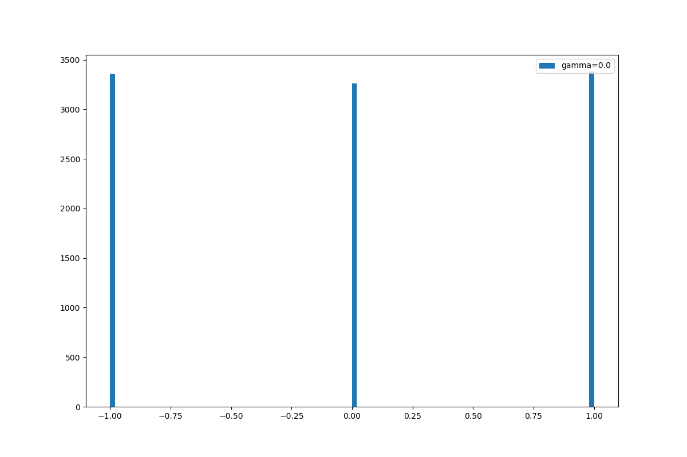
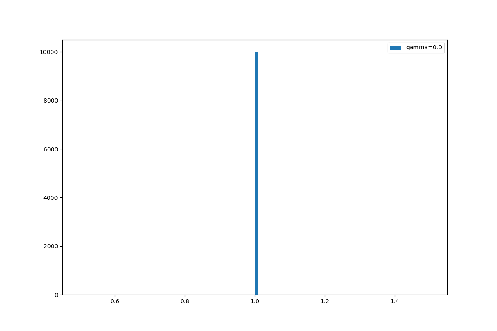

# COMP579 Assignment3

## Question 1.3

The rewards is computed for 100 time steps. The distribution is shown over 10000 samples with values of gamma ranging from 0 to 1. 

### Uniform on [1,2]

### Dirac distribution (-1, 0, 1)

### Normal distribution N(1,t)

